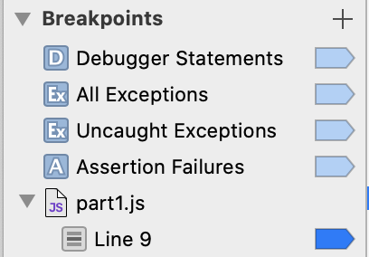
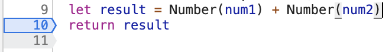
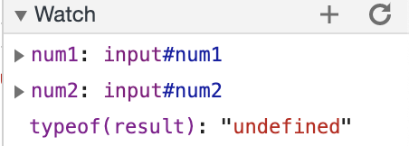

1. The program was concatenating the two inputs as a string instead of adding them numerically.
2. I would cast each input as a Number so that the result is the two numbers added numerically.

3. The new json file is called citylots.json.
4. Its initiator is part2.js.
5. It's 11.7 MB.
6. It took 263 ms to download.
7. The user agent was Mozilla/5.0 (Macintosh; Intel Mac OS X 10_15_7) AppleWebKit/537.36 (KHTML, like Gecko) Chrome/87.0.4280.88 Safari/537.36.
8. It came from an Apache server.
9.  It was last modified Tue, 26 Jan 2021 22:14:13 GMT.
10. It's application/json.
11. fetchData made the request.